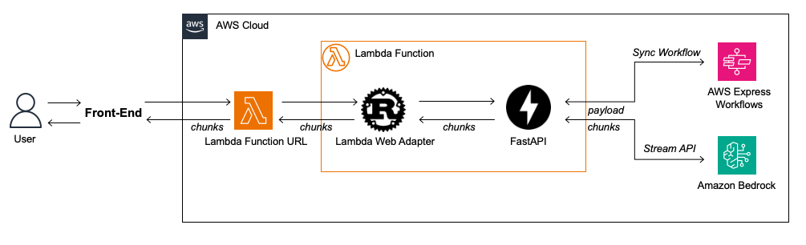
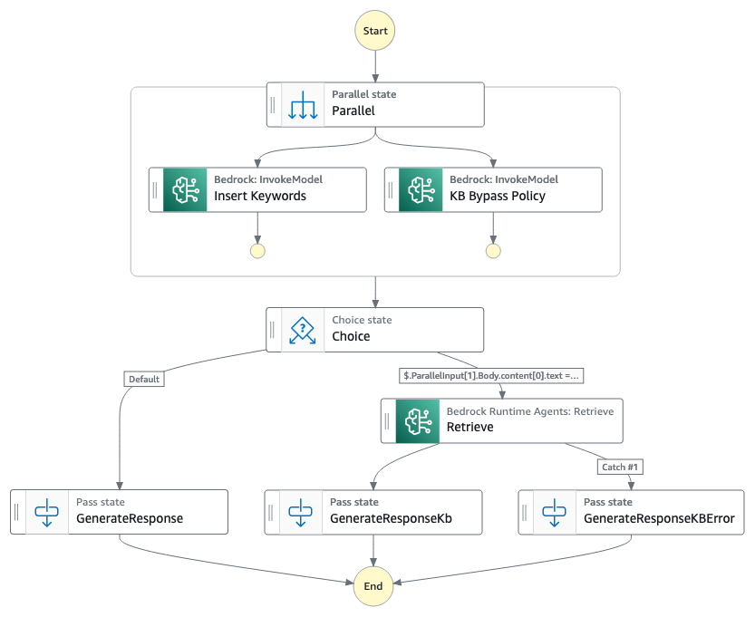
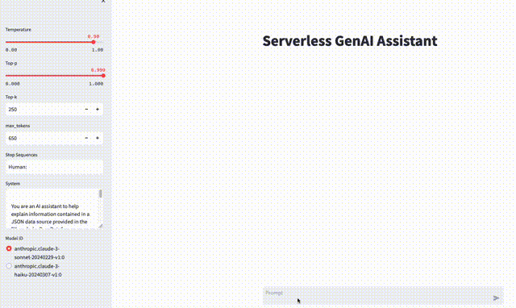

# Serverless GenAI Assistant

This example implements a GenAI Assistant that streams responses using AWS Lambda with AWS Lambda Web Adapter and takes advantage of low-code using AWS Step Functions to orchestrate workflows with Amazon Bedrock and other AWS services.



### How does it work?

The example uses AWS Lambda to execute a [Synchronous Express Workflow](https://docs.aws.amazon.com/step-functions/latest/dg/concepts-express-synchronous.html) that orchestrates multiples Bedrock API requests allowing the user to implement prompt engineering techniques like [Prompt Chaining](https://www.promptingguide.ai/techniques/prompt_chaining) and [ReAct](https://www.promptingguide.ai/techniques/react) using the [Workflow Studio](https://docs.aws.amazon.com/step-functions/latest/dg/workflow-studio-components.html) and the [ASL](https://states-language.net/spec.html), a JSON-based declarative language to prototype and experiment different integrations and prompt techniques without the need for extensive efforts. Lambda firstly invoke the [state machine](https://docs.aws.amazon.com/step-functions/latest/dg/getting-started-with-sfn.html#key-concepts-get-started) and use it's as a input to invoke the [InvokeModelWithResponseStream](https://docs.aws.amazon.com/bedrock/latest/APIReference/API_runtime_InvokeModelWithResponseStream.html) API, that returns a streamed response to the caller. Due to the stream response the TTFB (Time to First Byte) is shorter, improving the user experience of the GenAI assistant, which fits in the customer facing service scenarios.

The Lambda function uses [AWS Lambda Web Adapter](https://github.com/awslabs/aws-lambda-web-adapter/tree/main) and FastAPI. AWS Lambda Web Adapter allows developers to build web apps (http api) with familiar frameworks (e.g. Express.js, Next.js, Flask, SpringBoot, ASP.NET and Laravel, anything speaks HTTP 1.1/1.0). 
The Lambda function can be accessed using a [function url](https://docs.aws.amazon.com/lambda/latest/dg/lambda-urls.html) configured in [Response Stream mode](https://docs.aws.amazon.com/lambda/latest/dg/configuration-response-streaming.html). 

### How to take advantage of this pattern?

The combination of AWS Step Functions using Express Workflows and the Bedrock response stream API allows scenarios where the builder can use state machine [Tasks](https://docs.aws.amazon.com/step-functions/latest/dg/amazon-states-language-task-state.html) to define prompt chaining [subtasks](https://docs.anthropic.com/claude/docs/chain-prompts#tips-for-effective-prompt-chaining). Each Step Functions Task can invoke Amazon Bedrock API with a specific Large Language Model, in sequence or parallel for non-dependent prompt subtasks, and then orchestrate the result with other AWS Services APIs like AWS Lambda, Amazon API Gateway and [third-party APIs](https://docs.aws.amazon.com/step-functions/latest/dg/connect-third-party-apis.html).

Break LLM tasks into subtasks turns the prompt engineering easier since you focus on the specific result of the subtask. Also, it's easier to control the output tokens which reduce the [latency](https://docs.anthropic.com/claude/docs/reducing-latency#2-optimize-prompt-and-output-length) of subtasks that doesn't need to generate large outputs, for example, you can use the user prompt and ask to a most compact LLM like Claude 3 Haiku to return a boolean value and use it to define a deterministic path in a state machine by use a [Choice state](https://docs.aws.amazon.com/step-functions/latest/dg/amazon-states-language-choice-state.html) to check the true/false value. It will consume a short number of output tokens, reducing the latency and cost. The inference for a final response can be executed for Claude 3 Sonnet using stream response for a better response quality and [TTFB](https://docs.anthropic.com/claude/docs/reducing-latency#measuring-latency).

Here's a few scenarios where this pattern can be used:

- RAG: Use Step Functions invokes Bedrock to augment the user input and improve the user question by add keywords regarding the conversation context and them invoke Knowledge bases for Amazon Bedrock to execute a semantic search. While the "add keyword task" and "invoke Knowledge Bases" are low latency tasks, the user response will be generated using stream response for better experience.
- Router: Step Functions can be implemented as a [router](https://community.aws/content/2duj7Wn4o0gSC6gNMsSFpeYZ5uO/rethinking-ai-agents-why-a-simple-router-may-be-all-you-need) to merge deterministic and non-deterministic scenarios, for example: Understand that the customer contact is a potential churn and start a retention workflow.
- A/B Testing: Use A/B testing in Step Functions, allowing the low-code fast pace of implementation to test different experiments, make adjusts and elect the best one to you business. While you focus on the business rule, the lambda handles as an interface abstraction since you don't need to change the lambda code or chabge API contract for every experiment.
- API calling: The user input can be used to prompt LLM to generate data as a JSON, XML or create a SQL query based on a table structure. Then you can use the LLM output to execute Step Function Tasks that uses the generated data to call APIs and execute SQL queries on Databases. The lambda function can use the Step Functions output to execute stream response and provide the reasoning over the data generated.
---
## Implementation details

### State Machine - RAG



Using the state machine in ``examples/serverless_assistant_rag`` to exemplify how the workflow works, it implements a RAG architecture using [Claude 3 Haiku](https://aws.amazon.com/bedrock/claude/) with [Messages API](https://docs.anthropic.com/claude/reference/messages-examples), and also [Meta Llama 3 chat](https://llama.meta.com/docs/model-cards-and-prompt-formats/meta-llama-3) .

1. Receives the input data from lambda, and parallelizes for two API Bedrock tasks.
2. The first task will enhance the user question to add keywords in order to augment the semantic search. It uses Claude 3 Haiku.
3. The second task is a bypass policy. It will check the conversation context and return true/false to validates if a KB retrieval is really necessary. When avoided it will reduce the answer latency. It uses Llama 3 8B Instruct.
4. If the result is false, the Knowledge base is invoked using the user question + the added keywords, otherwise no content will be added. Note that there is an error handler if the Retrieve task fails. It adds the error content to the ``contex_output``, and use the ``system_chain_data`` to modify the original instructions.  
5. In order to pass a structured response, the [Pass states](https://docs.aws.amazon.com/step-functions/latest/dg/amazon-states-language-pass-state.html) is used to format the JSON output. This technique can be used to keep the Tasks flexible and use the pass state to filter/format the output to keep the API contract.


### Lambda

The lambda function is packaged as a Zip and the Lambda Adapter is attached as a layer, similar to the [fastapi-response-streaming-zip](https://github.com/awslabs/aws-lambda-web-adapter/tree/main/examples/fastapi-response-streaming-zip) example. After the deployment you can check the cloudformation output by the key TheFastAPIFunctionUrl that contains the lambda URL to invoke.

Lambda invokes the express workflow defined in `STATEMACHINE_STATE_MACHINE_ARN` environment variable and merges the content returned in `ContextOutput` attribute to the `system` parameter. The ContextOutput will be wrapped by [XML tags](https://docs.anthropic.com/claude/docs/use-xml-tags), that can be defined by the parameter `content_tag`.

The lambda is also the last subtask of prompt chaining, and it's ready to call Claude models that support Messages APIs. It means that the `ContextData` attribute in the state machine response is sent to the Bedrock stream API. The prompt instructions that guides the user interaction should be sent to lambda by the caller using the [`system`](https://docs.anthropic.com/claude/docs/system-prompts) parameter. The lambda function will them stream the response to the caller in chunks, check the [Run](#run) section to see examples. 

Here's an example of the prompt instructions format for `system` parameter where the `content_tag` is the string 'document' and the `ContextData` is a JSON:

```python
content_tag = 'document'

#the prompt below is the default prompt sent to the lambda function by the caller during the lambda URL invocation
system = """
<instructions>
You are an virtual assistant, use the JSON in the document xml tag to answer the user.
Use the attribute 'data_source' to provide the URL used as a source.
</instructions>
"""

#ContextOutput is part of Step Functions response
ContextData = {
    "text":"Example",
     "data_source": "URL"
}

#Format a new system attribute
f"{system}<{content_tag}>{ContextData}</{content_tag}>"
```

>**Note:** For this sample the ``template.yaml`` defines the ``AuthType`` of ``FunctionUrlConfig`` as ``None``. This sample is intended to provide an experimentation environment where the user can explore the architecture.
> For production use cases check how you can add [auth](https://docs.aws.amazon.com/lambda/latest/dg/urls-auth.html) layer and how to  [protect](https://aws.amazon.com/blogs/compute/protecting-an-aws-lambda-function-url-with-amazon-cloudfront-and-lambdaedge/) lambda url. 


### Prompt Instructions

#### First prompt
The prompt engineering architecture for this sample explores the [Prompt Chaining](https://www.promptingguide.ai/techniques/prompt_chaining) technique. To implement this technique the lambda functions expects to receive instructions in ``system`` parameter.
Use the first invocation to pass the instructions about how you expect the assistant to answer the user. In general, use the first prompt to define techniques like [Role Playing](https://docs.anthropic.com/claude/docs/give-claude-a-role,
[Few-Shot Prompting](https://www.promptingguide.ai/techniques/fewshot) and others. Using the first prompt to handle more complex instructions will allow to use 
the ``InvokeModelWithResponseStream`` API with powerful models that tends to be slower, but the TTFB will help to achieve a better responsiveness.


#### Next prompts 

The next prompts are defined in each Step Functions Task. You can use or not the first prompt in the Step Function tasks. It will depend on the use case.
Design the prompts in Step Function Tasks in concise and straightforward way, focus on solve a specific problem. Experiment with different models.

You can check the first prompt example at ``examples/serverless_assistant_rag/tests/system_prompt_samples.py`` and the prompt at each Task at ``examples/serverless_assistant_rag/statemachine/rag_parallel_taks/RagGenAI.asl.json``.

---
### Passing data to Step Functions state machine

You can send data aside LLM parameters through lambda to Step Functions state machine using the optional parameter ``state_machine_custom_params``. It expects a ``dict`` where you can choose the data you want to use in the state machine. 
As an example, if you would like to send information about a logged user, you can use the ``state_machine_custom_params`` and handle this information in the Step Functions state machine. Once the data is sent to Step Functions you can use all the resources in 
state machine to handle the information.

### Chaining to InvokeModelWithResponseStream

In this example the ``InvokeModelWithResponseStream`` is the last subtask of prompt chaining, it means that if the execution 
workflow in Step Functions gets new relevant data to original prompt instructions, it needs to send this data to the stream api aside 
of the ``context_data`` parameter because ``context_data`` is used to provide information chunks to help the LLM to generate answer, not instructions. To handle this scenario you can use the ``prompt_chain_data`` parameter.

The ``system_chain_prompt`` takes the original instructions in ``system`` parameter and allows you to make the following operations
to that prompt chain execution instance:

- ``APPEND`` - Adds new instructions to the end of original ``system`` parameter
- ``REPLACE_TAG`` - Replace the first <tag></tag> mapped in the ``system`` by new data. It provides a mechanism to
merge new instructions to original prompt instructions.
- ``REPLACE_ALL`` - Replace all the prompt in ``system`` by the content in ``system_chain_prompt`` parameter. Useful for cases where a system error happened,
or you have scenarios that needs a new prompt for each flow.

##### Why use the system_chain_data attribute? 
It avoids you to create complex prompt. When you add many instructions at a time to LLM, the prompt engineering tends to
get more complex to deal with edge scenarios, so instead you create a prompt with few rules to define how to answer questions but an 
exception rules for specific cases, which will demand you more reasoning, you can manipulate the instructions based on the path of your workflow
and give direct instructions where your LLM will not deal with ambiguity. 

#### Syntax


``` 
"system_chain_data": {
    "system_chain_prompt": string
    "operation": APPEND | REPLACE_TAG | REPLACE_ALL,
    "configuration": {
        replace_tag: string
    }
  }
```

Parameters:

- system_chain_data (dic)
  - system_chain_prompt (string) - Prompt instructions
  - operation (string) - The action to be executed in the lambda ``system`` parameter
  - configuration (dict) - At the moment configuration is intended to support ``REPLACE_TAG`` operation
  - replace_tag (string) - Required if ``REPLACE_TAG`` is used. Replace the tag in the original content of ``system`` 
    parameter.

#### Usage

Add the ``system_chain_data`` block in the Step Functions state machine, check if it is being sent as part of the state
machine response. You can check implement examples in ``examples/serverless_assistant_rag/statemachine/rag_parallel_taks/RagGenAI.asl.json``, at ``GenerateResponse`` and ``GenerateResponseKB`` states.


---
## Deployment

### Requirements
- [AWS SAM](https://docs.aws.amazon.com/serverless-application-model/latest/developerguide/what-is-sam.html)
- [AWS Account](https://aws.amazon.com/resources/create-account/)
- [Request access to Anthropic Claude 3 (Sonnet and Haiku), and Meta Llama 3 models](https://docs.aws.amazon.com/bedrock/latest/userguide/model-access.html)
- [Knowledge base to execute the Rag statemachine example](https://docs.aws.amazon.com/bedrock/latest/userguide/knowledge-base-create.html)

Note: If you are interested in deploy as Docker image, use [this example](https://github.com/awslabs/aws-lambda-web-adapter/tree/main/examples/fastapi-response-streaming)

### Build and Deploy

Run the following commands to build and deploy the application to lambda.

```bash
cd serverless-genai-assistant/examples/serverless-assistant-rag
sam build
sam deploy --guided
```
For the deployment options, define the following options:
```bash
Stack Name []: #Choose a stack name
AWS Region [us-east-1]: #Select a Region that supports Amazon Bedrock and the other AWS Services
Parameter KnowledgeBaseId []: #Insert the KB ID https://docs.aws.amazon.com/bedrock/latest/userguide/knowledge-base-manage.html#kb-
#Shows you resources changes to be deployed and require a 'Y' to initiate deploy
Confirm changes before deploy [y/N]: 
#SAM needs permission to be able to create roles to connect to the resources in your template
Allow SAM CLI IAM role creation [Y/n]: 
#Preserves the state of previously provisioned resources when an operation fails
Disable rollback [y/N]: 
FastAPIFunction Function Url has no authentication. Is this okay? [y/N]: y
Save arguments to configuration file [Y/n]: 
SAM configuration file [samconfig.toml]: 
SAM configuration environment [default]: 
```

>Copy the TheFastAPIFunctionUrl value, it's the url to invoke lambda.

>**Note:** If you don't provide a Knowledge base ID, you will receive answer from LLM informing a Bedrock error, for a complete experience check the [Requirements](#requirements) and create the Knowledge base.


## Run

### Terminal

```bash
cd serverless-genai-assistant/examples/serverless-assistant-rag/tests
curl --no-buffer -H "Content-Type: application/json" -X POST -d @test.json <lambda-url>
```

### Python
```bash
cd serverless-genai-assistant/examples/serverless-assistant-rag/tests
pip install requests
python test_stream_python_requests.py --lambda-url <lambda-url>
```

### Streamlit
```bash
cd serverless-genai-assistant/examples/serverless-assistant-rag/tests
pip install requests
pip install streamlit
streamlit run st_serverless_assistant.py -- --lambda-url <lambda-url>
```

### Serverless Gen AI Assistant on Streamlit

